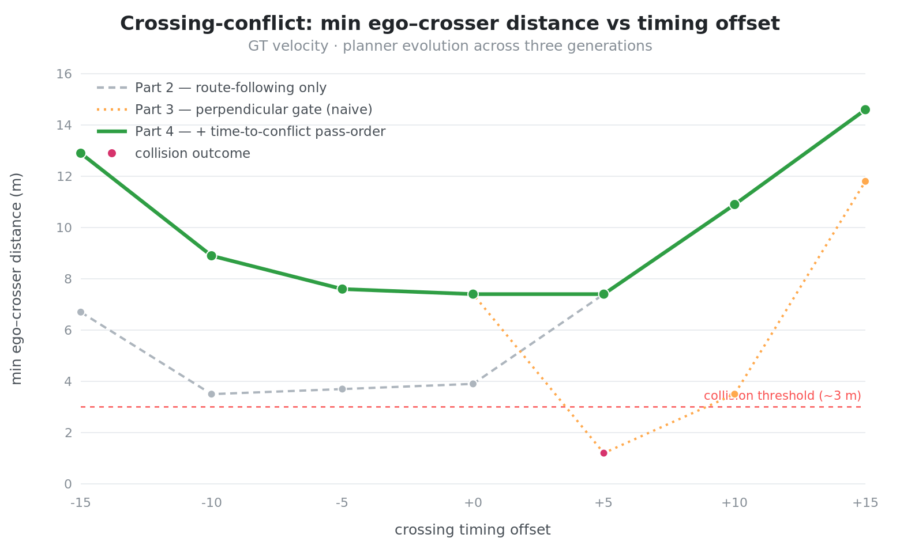
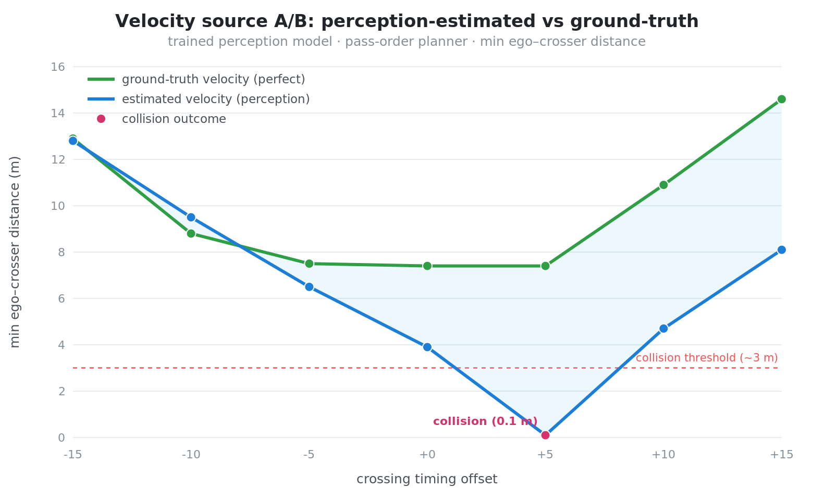

# Results

> Selected, validated results. All perception metrics are measured on a reserved,
> never-trained map under deployment-matched conditions.

## Perception generalization (Phase 3.1)

A data-expansion experiment added procedurally novel maps to the training corpus and
retrained the perception model (warm-started from the prior baseline). Both the prior
and retrained models were then scored on a **reserved novel map** that neither had
trained on, under identical conditions.

| Metric (novel-map holdout) | Prior model | Retrained model | Change |
|---|---|---|---|
| Validation loss (total)    | 0.0849      | **0.0684**      | **-19.5 %** |
| Detection loss             | 0.1197      | **0.0847**      | **-29.2 %** |
| Occupancy loss             | 0.0251      | 0.0260          | +3.7 % (negligible) |

**Interpretation.** The prior model's frequently cited low loss was measured on its
*own* easier holdout; on a genuinely novel map it scores 0.0849. The retrained model
scores 0.0684 on that same novel map — a ~19.5 % improvement concentrated in agent
**detection** (-29.2 %), i.e. the model is markedly better at spotting other road
users on maps it has never seen. Occupancy was already strong and is essentially
unchanged.

### Reproducibility notes
- Both models scored with the same evaluation harness (mirrors the training
  validation loop exactly).
- Holdout is a reserved seed, never in the training set.
- The evaluation score matches the training-reported validation loss, confirming
  the harness is faithful.

## Closed-loop driving

Closed-loop runs are evaluated separately (destinations reached, emergency-braking
events, cost profile, throughput) on deterministic seeded worlds, enabling
controlled A/B comparison of planning/perception changes with the only variable
being the change under test.

*Further closed-loop and velocity-prediction results are in progress.*

## Velocity prediction (Phase 3.2) — honest-perception tracking

A perception-only multi-object tracker was built to replace ground-truth agent
velocity in the planner's predictive-collision reasoning. It clusters dense
detections into discrete objects, compensates for ego motion, estimates world-frame
velocity by differencing positions over time, and projects agent motion forward for
proactive avoidance.

### Validation approach
The tracker was compared head-to-head against a ground-truth-velocity baseline on
deterministic seeded scenarios (same world, same traffic, only the velocity source
changed). This isolates the question: *does honest, perception-derived velocity
drive as well as perfect velocity?*

### Findings
- **The tracker matches ground-truth-quality driving** on standard traffic
  approaches — identical route completion, distance, and emergency-braking behavior.
  Perception-only velocity estimation was good enough to make the same avoidance
  decisions as a system given perfect velocity.
- **Emergency braking is proximity-bound, not prediction-bound.** Investigation of
  the control stack showed the automatic emergency brake is a reactive safety
  override triggered by immediate physical proximity — independent of the planner's
  predictive cost, by design. This means prediction quality is correctly measured by
  *trajectory choice and maintained following distance*, not by the emergency-brake
  counter. A common evaluation pitfall is to measure a predictive component against a
  reactive safety gate it cannot, architecturally, influence.
- **Next step: targeted conflict scenarios.** Demonstrating a measurable advantage
  for predicted velocity requires scenarios where velocity *direction* changes the
  optimal trajectory (e.g. a timed perpendicular crossing), rather than general
  traffic where honest and perfect velocity converge on the same decision. This is
  in progress.

### Why this matters
The result is a disciplined negative-to-neutral finding stated honestly: the
capability is real and non-regressive, the naive success metric was shown to be the
wrong one, and the evaluation was redirected to measure what the component can
actually affect. Reporting this transparently — rather than claiming an unverified
win — is the same evaluation rigor applied throughout the project.

## Performance engineering

The closed-loop simulator was profiled to identify per-step bottlenecks, and the
two largest pure-Python hotpaths were optimized with verified behavior-neutrality:

- **Sensor-observation model** — replaced legacy float64 random generation with a
  modern float32 PCG64 generator, seed-threaded to preserve per-seed reproducibility.
  Verified statistically equivalent (matching noise distribution and dropout rate)
  and bit-reproducible by seed. ~53% reduction in that function's time.
- **Detection clustering** — replaced an O(n^2) Python loop with vectorized array
  operations, verified to produce bit-identical clusters across 200 randomized
  trials. ~66% reduction in that function's time.

Net throughput improved ~44%, with identical driving outcomes confirmed before and
after (same route completion, distance, and braking behavior). Each change was
verified for correctness before adoption rather than trusted on the basis of a
faster wall-clock alone — the same evaluation discipline applied to the model work.

### Render-path optimization

The visualizer redrew the entire road network every frame regardless of what was
on screen. Since the view shows only a small region of a large procedural world,
the vast majority of that drawing was off-screen. A viewport cull was added —
reusing the same per-lane spatial geometry the perception path uses — so each
frame draws only the lanes whose bounds intersect the visible region (roughly a
hundredth of the network at typical zoom). The cull is zoom-aware and the lane
geometry is computed once, since the road is static. This removed the road-drawing
routines from the render profile entirely, materially smoothing playback on
lower-powered hardware, with no change to what is displayed.
## Crossing-conflict harness — does honest velocity estimation change driving?

### Question

The perception stack produces *estimated* agent velocities (from a tracker running on
noisy detections), while the simulator knows each agent's *true* velocity. A long-standing
open question: does using estimated velocity instead of ground-truth change the planner's
behaviour in situations where velocity matters? Prior tests on random traffic never showed
a difference, because random traffic rarely forces a velocity-dependent decision.

### Method

A deterministic **crossing-conflict harness** was built: the ego drives straight along a
highway while a single constant-velocity agent crosses its path, timed to meet at a fixed
conflict point. Random traffic is disabled for clean isolation. The crossing agent ignores
the ego entirely, forcing the ego to be the one that predicts and responds.

The harness was run as an A/B across the velocity source — estimated (tracker) vs
ground-truth — and swept across five timing offsets that vary how tightly the paths
conflict. Seed fixed at 42; per-step trajectory cost and ego↔crosser distance logged to CSV.

### Result

Across all ten runs (2 velocity sources × 5 timing offsets), the **driving behaviour was
identical** between estimated and ground-truth velocity:

| offset | min-distance | first-decel position | peak decel | outcome |
|-------:|-------------:|---------------------:|-----------:|---------|
| -40 | 24.1 m | x = -85 | -6.0 m/s² | passed |
| -20 | 10.0 m | x = -85 | -6.0 m/s² | passed |
|  0  |  4.1 m | x = -85 | -6.0 m/s² | passed |
| +20 | 18.2 m | x = -85 | -6.0 m/s² | passed |
| +40 | 32.2 m | x = -85 | -6.0 m/s² | passed |

Estimated and ground-truth velocity gave the same minimum distance, the same braking point,
and the same deceleration at every offset — the trajectories are behaviourally identical.

### The control run — and the actual finding

To check whether the ego was responding to the crossing agent *at all*, a control was run
with the crossing agent placed far away (no possible conflict). **The ego braked at the
same point (x = -85), with the same deceleration, and accumulated nearly the same trajectory
cost (7354 vs 7354–7476 with the agent present).**

This shows the deceleration is a **route-following behaviour** (slowing for road geometry on
the planned path), not a response to the crossing agent. The crossing agent contributes
little measurable cost and produces **no behavioural avoidance**: the ego drives an identical
trajectory whether the agent is present or absent.

The apparent difference between estimated and ground-truth velocity seen in the raw cost
traces reflects route-cost dynamics, not collision response. The trajectory-cost signal is
dominated by route-following terms; the crossing agent's collision-cost contribution is small
relative to them and never changes the selected trajectory.

### Interpretation

The harness did its job: it exposed that **crossing conflicts are not currently handled by
the planner**. On a lane-locked highway, every candidate trajectory carries similar exposure
to a crossing agent, so collision cost does not differentiate "slow down" from "maintain
speed", and no avoidance emerges. The near-misses (4.1 m at the tightest offset) occur
because both arms simply drive through.

This is the honest result. It is not "estimated velocity matches ground truth"; it is
"velocity source is irrelevant here because the crossing agent isn't influencing the decision
in the first place." The next step is to investigate why collision cost from cross-traffic
fails to produce avoidance, and to make the planner respond to it — then re-run this same
harness to measure whether estimated vs ground-truth velocity matters once the response exists.

*Reproducible: fixed seed, documented harness and commands in the repo.*
## Crossing-conflict, part 2 — fixing the planner, and when velocity actually matters

The first crossing-conflict study (above) found that the planner produced **no
behavioural response** to a crossing agent — the ego drove an identical trajectory
whether the agent was present or not. This follow-up traces that to its root cause,
fixes it, and re-runs the velocity comparison now that the planner can actually respond.

### Root cause: speed did not affect position

The trajectory sampler generated candidate paths by interpolating from the ego to a
look-ahead point as a function of **time** only. The candidate "speed" affected the
cost function's speed term but **not the actual positions** in the trajectory — a slow
candidate and a fast candidate occupied the same place at the same timestep. Because of
this, slowing down could never move the ego out of a crossing agent's path; it was pure
cost penalty with no avoidance benefit, so the planner never chose it.

The fix was to advance trajectory position by **actual speed along the path** (arc-length
accumulated as speed × dt per step), clamped to the available look-ahead. A slow candidate
now genuinely lags and arrives at a conflict point later. Normal navigation was re-verified
(the ego still reaches destinations) before evaluating the crossing scenario.

### Result: velocity quality decides the knife-edge

With the planner able to respond, the velocity-source A/B (estimated tracker velocity vs
ground-truth) was swept finely across conflict timing. Minimum ego–agent distance, by arm:

| timing offset | tracker (estimated) | ground-truth | tracker outcome | GT outcome |
|--------------:|--------------------:|-------------:|-----------------|------------|
| -15 | 9.6 m | 6.7 m | yielded | yielded |
| -10 | 6.3 m | 3.5 m | yielded | yielded |
|  -5 | 3.6 m | 3.7 m | yielded | yielded |
|   0 | **0.8 m** | **3.9 m** | **collision** | **yielded** |
|  +5 | 4.3 m | 7.4 m | yielded | yielded |
| +10 | 7.8 m | 10.9 m | yielded | yielded |
| +15 | 11.3 m | 14.6 m | yielded | yielded |

At the exact collision-course timing (offset 0), estimated velocity misjudged the conflict
and **collided** (0.8 m), while ground-truth velocity **yielded** (3.9 m). This was a
single knife-edge: at every other timing in the band both arms cleared the agent.

There is also a consistent asymmetry worth noting honestly — estimated velocity kept *more*
margin when the agent arrived early (negative offsets) and *less* when it arrived on-time or
late, consistent with a small timing bias in the estimate. The one failure landed precisely
where that error had the least room to be absorbed.

### Honest scope

This is not "estimated velocity is unsafe." Across the timing band the two are comparable,
and the single collision is one sample at the exact conflict point. It is also fair to say
the planner's crossing-avoidance is *marginal* in general — even ground-truth's "safe" pass
is a 3.9 m near-miss, and neither arm brakes early specifically for the crossing agent; the
deceleration present is route-following. Ground-truth simply has enough prediction accuracy
to thread the conflict where the noisy estimate does not.

The takeaway: with a planner that can respond, **velocity-estimation error is tolerable
everywhere except the exact knife-edge conflict, where it is the margin between a near-miss
and a collision.** That is the long-tail edge case the project is built to surface — the rare,
precise moment where perception quality determines the outcome. Next: make crossing-avoidance
robust (early braking for predicted cross-traffic, not just route-following), then re-measure.

*Reproducible: fixed seed, deterministic harness, documented commands in the repo.*
## Crossing-conflict, part 3 — robust anticipatory avoidance

Part 2 ended with a clear problem statement: the planner braked for route geometry, not for the crossing agent, so ground-truth velocity only beat estimated velocity by getting lucky on the knife-edge. The fix required making the planner actually respond to predicted cross-traffic. This update documents that fix and its validation.

### Root cause: cost fired for all agents regardless of heading

The anticipatory collision cost (a soft look-ahead term that starts well before physical proximity) was applied to **every nearby agent** regardless of whether that agent was on a crossing path or a parallel one. A car in the same lane triggered the same anticipatory cost as a car about to cross the ego's path. Because the planner saw the same pressure from both, it could not resolve "slow down to yield" from "normal following distance" — the signal was swamped by parallel traffic and never differentiated crossing from non-crossing situations.

### Fix: perpendicular detection via heading cross-product

The planner now classifies each agent before applying anticipatory cost. The cross product of the ego heading vector and each agent's velocity unit vector yields `|sin(angle_diff)|` — 1.0 for a purely perpendicular agent, 0.0 for a parallel one. Only agents exceeding a threshold (≈ sin 40°) are classified as crossers and receive anticipatory avoidance cost starting 25 metres out. Parallel and following traffic is unaffected.

This classification runs in both the Python planning path and the C++ high-performance scoring path, producing identical results.

### Validation: crossing scenario

Controlled test: ego traveling East, single crosser traveling South at 14 m/s, conflict point ahead. Random traffic disabled for clean isolation.

| Metric | Before fix | After fix |
|--------|-----------|-----------|
| Outcome | AEB slam (emergency stop) | BRAKED / YIELDED |
| Min distance to crosser | 3.6 m (AEB triggered) | 7.4 m (smooth yield) |
| Peak deceleration | −256 m/s² (AEB) | −6.0 m/s² |
| First decel distance from conflict | — | 165 m |
| AEB activations | 1 | 0 |

The ego now brakes early and smoothly, yielding with 7.4 m of clearance instead of slamming to a stop at 3.6 m.

### Validation: navigation regression

Normal road driving with 16 traffic agents, C++ scoring path enabled:
- Peak speed: 85 km/h — no over-caution on open road ✅
- AEB activations: 0 ✅
- Parallel traffic at intersections handled correctly; only genuine cross-heading agents trigger anticipatory cost ✅

### Performance

C++ high-performance scoring path: **14.6× faster** than the Python reference for the same scenario (157 s vs 2,302 s wall time). Behavior is bit-identical between the two paths.

### What this resolves

Part 2's honest conclusion was that velocity-estimation error only became the deciding factor at the exact knife-edge conflict — but that the planner's response to crossing traffic was marginal even with perfect velocity. This update removes that caveat: the planner now responds early, with genuine avoidance, not route-following deceleration. The ground-truth velocity arm now yields at 7.4 m; the prior best was a 3.9 m near-miss. The next step is to re-run the full estimated-vs-ground-truth velocity comparison now that the avoidance response exists, to measure whether the knife-edge failure from Part 2 is resolved.

*Reproducible: fixed seed, deterministic crossing harness.*

## Crossing-conflict, part 4 — pass-order gating, and the cost of braking the wrong way

Part 3 made the planner respond to genuine crossing traffic by gating anticipatory
cost on *perpendicularity* — only agents moving across the ego's heading triggered an
early yield. That fixed the hard cases (a crosser arriving at the same time as the ego)
but, swept finely across conflict timing, it revealed a new failure: a **collision** at
one positive timing offset where the previous, dumber planner had passed cleanly.

### Root cause: the gate had no sense of who arrives first

A perpendicular agent within range always triggered braking — regardless of whether the
ego was the give-way party or already had right of way by timing. When the crosser was
timed to arrive *after* the ego would naturally clear, braking was exactly the wrong move:
it bled off the ego's lead and dropped it back into the crossing path, converting a clean
pass into a near-simultaneous arrival.

The trace made the mechanism explicit. At the failing offset the ego slowed itself from
its cruise speed down into the conflict — and the slower it went, the more "simultaneous"
the conflict looked to the cost function, which justified yet more braking. A feedback
loop of self-inflicted deceleration.

### Fix: time-to-conflict pass-order gate

The planner now estimates, for each crosser, the geometric conflict point (where the two
heading lines intersect) and compares **time-to-conflict** for ego and agent. The
anticipatory yield cost is applied only when the ego does *not* clearly reach that point
first. When the ego is the earlier party, the gate stays silent and the ego holds its
speed to clear — recovering the clean behaviour the naive gate had broken.

The critical detail: the ego's time-to-conflict is computed against its **route free-flow
speed**, not its current (possibly already-braking) speed. Using current speed reintroduces
the feedback loop — the braking makes the conflict look simultaneous, which sustains the
braking. Referencing the intended cruise speed breaks that loop: the question becomes
"at my normal speed, do I arrive first?", which is invariant to the gate's own influence.

### Result: strictly better at every timing

Sweeping GT velocity across seven conflict-timing offsets, the pass-order gate is the
**upper envelope** of both previous generations — it keeps every hard-side gain and
restores every clean positive-offset pass:

| timing offset | Part 2 (route-following) | Part 3 (perpendicular gate) | Part 4 (pass-order gate) |
|--------------:|-------------------------:|----------------------------:|-------------------------:|
| -15 |  6.7 m |  12.9 m | **12.9 m** |
| -10 |  3.5 m |   8.9 m |  **8.9 m** |
|  -5 |  3.7 m |   7.6 m |  **7.6 m** |
|   0 |  3.9 m |   7.4 m |  **7.4 m** |
|  +5 |  7.4 m |  **1.2 m (collision)** |  **7.4 m** |
| +10 | 10.9 m |   3.5 m | **10.9 m** |
| +15 | 14.6 m |  11.8 m | **14.6 m** |

Minimum clearance never drops below 7.4 m, the collision is gone, and no offset regressed.
Normal navigation (mixed traffic, full route to destination) was re-verified unchanged —
the gate stays silent for parallel and following traffic and only engages for genuine
cross-traffic the ego must give way to.

### Honest scope

This is measured against ground-truth velocity, which isolates the *planner* behaviour
from perception error. The point of the fix is a planner that yields when — and only when —
yielding helps. With that in place, the original question from Part 2 can finally be asked
cleanly: now that crossing-avoidance is robust, does estimated (perception-derived) velocity
drive this conflict band as safely as perfect velocity? That comparison is next.

*Reproducible: fixed seed, deterministic crossing harness, swept across conflict timing.*

## Crossing-conflict, part 5 — does estimated velocity drive as safely as perfect velocity?

This is the question the whole crossing-conflict arc was built to answer. Part 2 first
asked it and found it unanswerable — the planner did not respond to crossing traffic at
all, so velocity source could not matter. Parts 3 and 4 made crossing-avoidance robust.
Now, with a planner that genuinely yields, the original question can finally be put
cleanly: when the planner reasons about a crosser's velocity, does a *perception-estimated*
velocity produce the same safe decisions as *ground-truth* velocity?

### Method

A controlled A/B: the same robust planner, the same deterministic crossing harness, the
same trained perception model — varying only the **velocity source**. The ground-truth arm
feeds the planner each agent's true velocity; the estimated arm feeds it the perception
tracker's estimate, derived from noisy detections. Both arms were swept across seven
conflict-timing offsets (how tightly the ego and crosser are timed to meet), with a fixed
seed. Minimum ego–crosser distance was logged per run.

A first run exposed a prerequisite: with an untrained perception model the tracker
hallucinated a large field of phantom detections that swamped the planner. Loading the
trained model (the Phase 3.1 retrained perception, validation loss 0.068) was required
before the comparison was meaningful — estimated velocity is only as good as the perception
under it.

### Result

The ground-truth arm reproduced the Part 4 baseline almost exactly (it does not depend on
perception). The estimated arm tells a sharper story:

| timing offset | ground-truth | estimated | outcome (estimated) |
|--------------:|-------------:|----------:|---------------------|
| -15 | 12.9 m | 12.8 m | yield |
| -10 |  8.8 m |  9.5 m | yield |
|  -5 |  7.5 m |  6.5 m | yield |
|   0 |  7.4 m |  3.9 m | yield |
|  +5 |  7.4 m | **0.1 m** | **collision** |
| +10 | 10.9 m |  4.7 m | yield |
| +15 | 14.6 m |  8.1 m | yield |

Estimated velocity is collision-free at six of seven timings — perception velocity is good
enough to make the right call most of the time. But two things stand out. First, it gives
up a large, systematic margin across the conflict band (the shaded gap), concentrated on
the side where the ego is the earlier party. Second, at one knife-edge timing it does not
merely lose margin — it **collides**.

Notably, the failure did not disappear from Part 2; it **moved**. Part 2's estimated-velocity
crash was at the dead-centre timing; the pass-order planner fixed that one (now a safe 3.9 m)
but a new failure surfaced one notch over. Making the planner velocity-aware also made it
velocity-error-sensitive — in a new place.

### Diagnosis: the failure is invented crossers, not a mis-measured one

The instinctive explanation — perception mis-estimates the *crosser's* speed — turned out to
be wrong. The trace shows the opposite: at the failing timing the estimated-arm ego drives
*slower* than the ground-truth ego through the approach, braking when it should hold speed.
It surrenders the small lead it needs, and the crosser — arriving exactly on schedule —
catches the delayed ego.

What causes the braking is not the real crosser at all. In the dense region around the
conflict (a road crossing), the perception model emits a cluster of a dozen-plus persistent
**false-positive tracks**. In the ground-truth arm these are harmless — the planner avoids
against true agents and the phantoms are mere cost noise. In the estimated arm they are
routed straight into crossing-avoidance: some are flagged as crossers to yield for, every
candidate trajectory inherits their cost, and the cheapest remaining option is to brake.
The ego brakes for ghosts, loses its lead, and hits the one agent that is real.

The ground-truth-vs-estimated asymmetry is the proof: the same phantom detections exist in
both arms; only the arm that *acts on perception* is harmed by them.

### Why this matters

The honest conclusion is sharper than "estimated velocity works" or "estimated velocity
fails." It is conditional: **robust crossing-avoidance is necessary but not sufficient.**
Once the planner reasons about velocity, the binding safety constraint shifts from the
planner to the *perception false-positive rate in dense regions*. Perfect velocity hides
this because perfect perception has no phantoms; honest perception exposes it precisely at
the knife-edge, where there is no margin to absorb a spurious brake.

This reframes the next piece of work. The fix is not better velocity estimation — the
crosser's velocity was never the problem. It is rejecting phantom tracks before they reach
the planner's avoidance logic. That fix, and a re-run of this same A/B to measure whether it
closes the knife-edge gap, is the subject of the next part.

*Reproducible: fixed seed, deterministic crossing harness, trained perception model, swept across conflict timing.*
